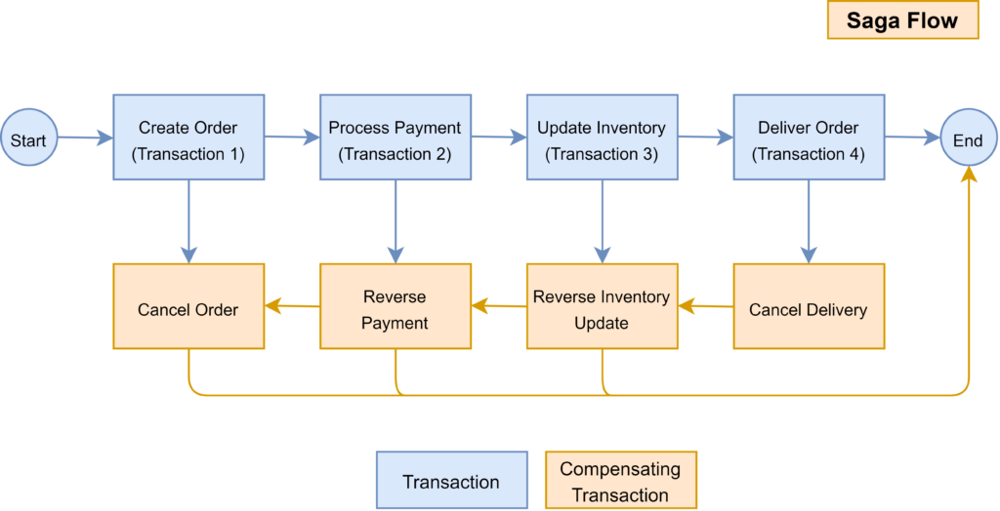

# Distributed Transactions Using Saga Pattern - Choreography

## Introduction

This project is a sample implementation of the Saga Pattern using Choreography. It is a simple application that allows users to create a new order and pay for it. The application is implemented using Spring Boot and Spring Cloud Stream. The communication between the services is done using Apache Kafka.

## What is Saga Pattern?

- The Saga Pattern is a pattern for managing distributed transactions. It is a sequence of local transactions.
- Each local transaction updates the database and publishes a message or event to trigger the next local transaction in the saga.
- If a local transaction fails because it violates a business rule then the saga executes a series of "compensating transactions" that undo the changes that were made by the preceding local transactions.
- For example, you can take a look at the image below:



## Getting Started

### Prerequisites

You need to have the following installed on your machine:

- [Java 21](https://www.oracle.com/java/technologies/downloads/)
- [Docker](https://docs.docker.com/engine/install/)
- [Docker Compose](https://docs.docker.com/compose/install/)

### Running the Application

First start the Kafka cluster, Database and administation tools by running the following command:

```bash
docker-compose up -d
```

Then start each services by running the following command:

```bash
./mvnw spring-boot:run
```
